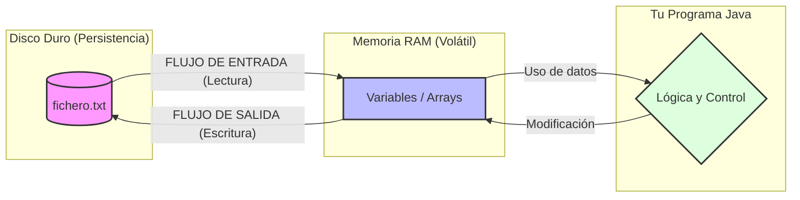

# Bloque 5: Flujos y Ficheros para guardar datos

En el desarrollo de aplicaciones reales, rara vez trabajamos solo con datos introducidos por el usuario durante la ejecución. Muchas veces es necesario guardar información para usarla más adelante (como resultados, configuraciones, listas de usuarios o registros), o bien leer datos almacenados previamente para procesarlos.

Recuerda que las variables se guardan en memoria RAM, por lo que cuando apagues tu app, los datos se borrarán. Para que la información sea persistente (no se borre), debemos guardarla en el Disco Duro (ficheros).



### Lectura y escritura de datos

Un **flujo o Stream** es un canal de comunicación por el que circulan datos desde una lugar hacia otro. Java clasifica los flujos en dos tipos principales:

- **Flujos de entrada (Input)**: para que Java lea datos que vienen desde otro sitio (como un fichero).
- **Flujos de salida (Output)**: para que Java escriba datos en otro sitio (como un fichero).

Los flujos de entrada y salida pueden manejar los datos en distintos formatos, lo cual implica que tengamos flujos de bytes y flujos de caracteres:

### Tipos de flujos

Dependiendo de lo que se quiera enviar/recibir, se pueden usar dos tipos de flujos (caminos) en Java:
- **Flujos de bytes**: los datos viajan en binario, ideal para enviar o recibir imágenes, vídeos, ficheros comprimidos, etc. Se utilizan las clases `FileInputStream` para leer y `FileOutputStream` para escribir.
- **Flujos de caracteres**: los datos viajan en texto plano, ideal para textos en `.txt` y similares. Se utilizan las clases `FileReader` para leer y `FileWriter` para escribir.

En nuestro caso, utilizaremos por ahora solo **Flujos de caracteres**.

### Mejorar del rendimiento con `Buffered`

Para no escribir o leer caracter a caracter, lo que sería muy lento para el PC, se utilizan los `Buffered`, consiguen almacenar datos en memoria para leer o escribir muchos caracteres de golpe. En la práctica, usaremos Buffered en todos los ejercicios.

Java cuenta con las clases ya preparadas para esto:

| Clase básica          | Clase con buffer              | Tipo de datos     | Mejoras                                                |
|-----------------------|-------------------------------|-------------------|--------------------------------------------------------|
| `FileReader`          | `BufferedReader`              | Texto (lectura)   | Lee por líneas en vez de caracter a caracter.          |
| `FileWriter`          | `BufferedWriter`              | Texto (escritura) | Escribe por bloques en vez de caracter a caracter.     |

En resumen, aunque podemos usar ambos tipos, usaremos las clases `Buffered` cuando se espera leer o escribir más de unos pocos caracteres, dejando las clases básicas solo para tareas muy simples (lectura o escritura de un solo caracter, por ejemplo, lo cual en la práctica casi nunca sucede).

### Excepciones

Al leer y escribir en ficheros a través de flujos, pueden suceder errores y, para que el programa no se rompa, se utilizan las **Excepciones**. Consiste en meter todo el código dentro de un bloque `try` seguido de un bloque `catch` que indica lo que hacer si hay algún fallo. Es una estructura similar al `if`-`else` pero pensada específicamente para errores concretos.

### Ejemplos de código

Ejemplo 1: Leer un archivo de texto línea por línea con BufferedReader:

```java
try {
    BufferedReader br = new BufferedReader(new FileReader("texto.txt"));
    String linea;
    while ((linea = br.readLine()) != null) {
        System.out.println(linea);
    }
    br.close();
} catch (Exception e) {
    System.out.println("Error al leer el archivo: " + e.getMessage());
}
```

Ejemplo 2: Escribir varias líneas en un archivo de texto con BufferedWriter:

```java
try {
    BufferedWriter bw = new BufferedWriter(new FileWriter("salida.txt", false));
    bw.write("Primera línea");
    bw.newLine();
    bw.write("Segunda línea");
    bw.close();
} catch (Exception e) {
    System.out.println("Error al escribir en el archivo: " + e.getMessage());
}

```

¡Ojo! Observa la primera línea donde se crea el Buffer, ¿ves un `false`? Ahí también se podría poner `true`. Veamos para qué sirve cada uno:
- `new FileWriter("archivo.txt", true)`: Modo Append (Añadir). Los datos nuevos se pegan al final.
- `new FileWriter("archivo.txt", false)`: Modo Overwrite (Sobrescribir). Borra todo lo que hubiera antes y escribe desde cero.
